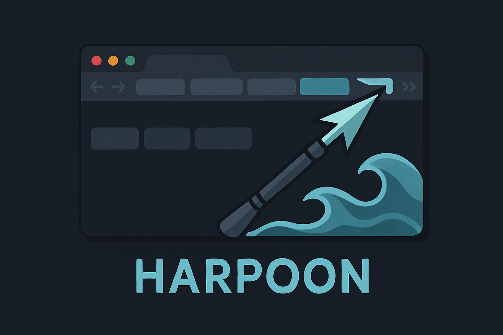

# Chrome Harpoon (Beta)

[](https://chromewebstore.google.com/detail/web-harpoon/kjcljpflpbjllhimbmikkcdpfdahbiho?authuser=0&hl=en)

<!-- Banner Image -->
 <!-- Replace with your actual image path -->

## Overview

**Chrome Harpoon** is a productivity-focused Chrome extension that helps you stay in flow by letting you quickly mark and jump to frequently used tabs with custom keybindings. Inspired by tools like Vim's Harpoon, it’s designed for anyone who wants faster tab navigation without reaching for the mouse.
If you sometimes struggle to find which tab you wanted to switch back to from your tens or even hundreds of tabs, this extension is for you!

## Features

⚓ Pin Tabs – Use Alt + A to pin your current tab.

🔢 Quick Access – Jump to a pinned tab with Alt + 1 through Alt + 9, and Alt + 0 for the 10th.

🔄 Toggle Tabs – Use Alt + Z to switch back to the previously selected tab.

↩️ Undo Switches – Use Alt + Y to undo a tab switch.

## Installation

Install directly from the Chrome Web Store:

👉 [Chrome Harpoon on the Web Store](https://chromewebstore.google.com/detail/web-harpoon/kjcljpflpbjllhimbmikkcdpfdahbiho?authuser=0&hl=en)

## Usage

1. Press `Alt+H` (or your chosen shortcut) to open the Harpoon UI.
2. Press a number key to jump to a previously marked tab.
3. Customize your marks and shortcuts in the extension settings.

## Development

To run locally:

```bash
git clone https://github.com/YOUR_USERNAME/Chrome-Harpoon.git
cd Chrome-Harpoon
# Load the folder as an unpacked extension in Chrome
